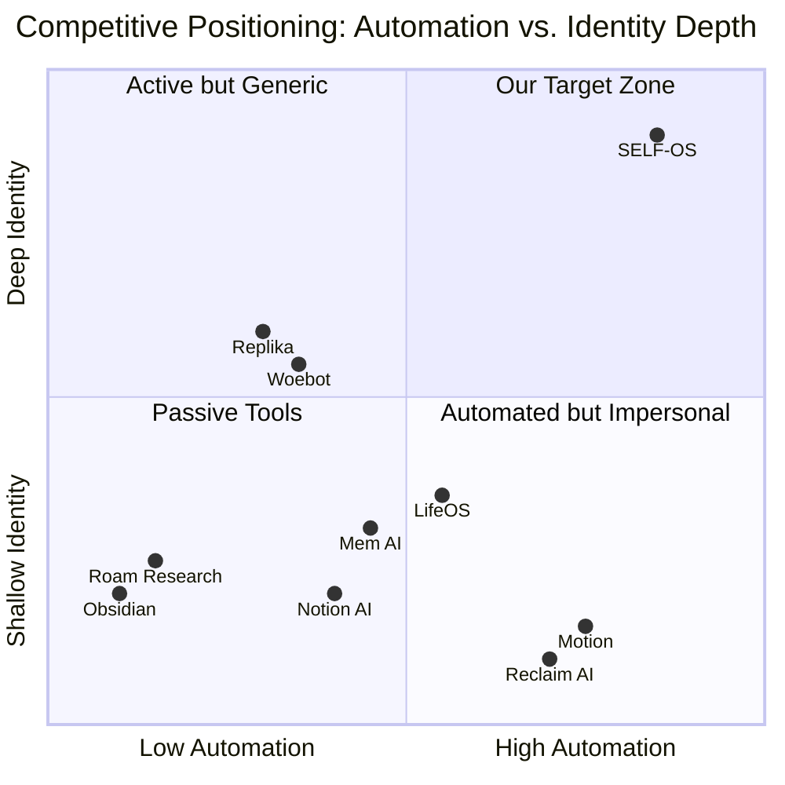

# SELF-OS — Competitive Analysis

> How SELF-OS compares to the landscape, where the gaps are, and why the identity layer is defensible.

---

## 1. Competitive Landscape Overview

The competitive space fractures across three distinct categories. SELF-OS is the only product that spans all three.



---

## 2. Detailed Competitive Matrix

> ✅ Full capability | ⚠️ Partial capability | ❌ Not available

| Dimension | SELF-OS | Obsidian +AI | Roam Research | Mem AI | Notion AI | Motion | Reclaim AI | LifeOS | Capacities | Reflect | Woebot | Wysa | BetterHelp | Replika |
|---|---|---|---|---|---|---|---|---|---|---|---|---|---|---|
| **Pricing (monthly)** | $0–$30 | $0–$17 | $15 | $8–$14.99 | $8–$20 | $19–$34 | Free–$12 | $29 | $9–$16 | $10 | Free–$15 | Free–$30 | $65–$100+ | Free–$17 |
| **Free Tier** | ✅ | ✅ | ❌ | ⚠️ | ⚠️ | ❌ | ✅ | ❌ | ⚠️ | ❌ | ✅ | ✅ | ❌ | ✅ |
| **Knowledge Graph / Second Brain** | ✅ | ✅ | ✅ | ⚠️ | ⚠️ | ❌ | ❌ | ⚠️ | ✅ | ⚠️ | ❌ | ❌ | ❌ | ❌ |
| **AI Auto-organization** | ✅ | ⚠️ | ❌ | ✅ | ⚠️ | ❌ | ❌ | ⚠️ | ⚠️ | ⚠️ | ❌ | ❌ | ❌ | ❌ |
| **Task Management** | ✅ | ⚠️ | ⚠️ | ⚠️ | ✅ | ✅ | ✅ | ✅ | ⚠️ | ❌ | ❌ | ❌ | ❌ | ❌ |
| **Autonomous Agent (Proactive)** | ✅ | ❌ | ❌ | ❌ | ❌ | ⚠️ | ⚠️ | ⚠️ | ❌ | ❌ | ❌ | ❌ | ❌ | ❌ |
| **Goal Tracking** | ✅ | ⚠️ | ⚠️ | ❌ | ⚠️ | ✅ | ✅ | ✅ | ❌ | ❌ | ❌ | ❌ | ❌ | ❌ |
| **Identity Model / Psyche Layer** | ✅ | ❌ | ❌ | ❌ | ❌ | ❌ | ❌ | ⚠️ | ❌ | ❌ | ⚠️ | ⚠️ | ❌ | ⚠️ |
| **Emotional Intelligence** | ✅ | ❌ | ❌ | ❌ | ❌ | ❌ | ❌ | ⚠️ | ❌ | ❌ | ✅ | ✅ | ✅ | ✅ |
| **Predictive Analytics** | ✅ | ❌ | ❌ | ❌ | ❌ | ⚠️ | ⚠️ | ❌ | ❌ | ❌ | ❌ | ❌ | ❌ | ❌ |
| **IFS / Parts Work** | ✅ | ❌ | ❌ | ❌ | ❌ | ❌ | ❌ | ❌ | ❌ | ❌ | ⚠️ | ❌ | ⚠️ | ❌ |
| **Calendar Integration** | ✅ | ❌ | ❌ | ❌ | ⚠️ | ✅ | ✅ | ✅ | ❌ | ❌ | ❌ | ❌ | ❌ | ❌ |
| **API for External Agents** | ✅ | ❌ | ❌ | ❌ | ⚠️ | ❌ | ❌ | ❌ | ❌ | ❌ | ❌ | ❌ | ❌ | ❌ |
| **Privacy (Local-first option)** | ✅ | ✅ | ❌ | ❌ | ❌ | ❌ | ❌ | ❌ | ❌ | ❌ | ❌ | ❌ | ❌ | ❌ |
| **Target Audience** | Knowledge workers, founders, self-dev | Knowledge workers | Researchers | Professionals | Teams | Professionals | Professionals | Productivity | Creatives | Writers | Mental health | Mental health | Mental health | Social / emotional |

---

## 3. Competitor Deep Dives

### 3.1 PKM Tools (Second Brain Competitors)

**Obsidian**
- The gold standard for personal knowledge management; beloved by power users
- Strength: local-first, plugin ecosystem, Zettelkasten support
- Weakness: requires manual linking and tagging; AI features are plugin-dependent and shallow; no identity model; no proactive agent
- **SELF-OS advantage:** zero-friction capture (no manual organization), living identity model, proactive agent

**Roam Research**
- Pioneered bidirectional linking; strong among academics and researchers
- Strength: daily notes paradigm, block-level references
- Weakness: steep learning curve, dated UI, no meaningful AI, no identity layer, expensive ($15/month for a text editor)
- **SELF-OS advantage:** all of Roam's conceptual strengths, executed with AI automation

**Mem AI**
- Closest PKM competitor with AI auto-organization
- Strength: solid AI-powered search and organization, chat interface
- Weakness: no identity/psyche model, no autonomous agent, no goal tracking, no proactive behavior
- **SELF-OS advantage:** the entire identity + agent layer

**Capacities & Reflect**
- Modern PKM tools with good UX
- Weakness: limited AI, no identity model, no agent behavior
- **SELF-OS advantage:** full second brain + intelligence + identity stack

---

### 3.2 Agent / Productivity Tools (Agent OS Competitors)

**Motion**
- Strong AI-powered calendar and task scheduling
- Strength: smart scheduling, deadline management, calendar blocking
- Weakness: schedules *tasks*, not *goals*; no understanding of who the user is; no emotional context; no identity model
- **SELF-OS advantage:** state-aware scheduling that respects energy, values, and psychological context

**Reclaim AI**
- Calendar optimization and habit blocking
- Strength: good calendar sync, habit protection
- Weakness: purely calendar-focused; no knowledge management, no identity model, no goal hierarchy
- **SELF-OS advantage:** full-stack intelligence, not just calendar optimization

**LifeOS (Notion-based)**
- Popular Notion template system for life management
- Strength: comprehensive goal + habit + project framework
- Weakness: manually maintained, no real AI intelligence, no identity model, Notion dependency
- **SELF-OS advantage:** built-in intelligence; no templates to maintain; identity layer

---

### 3.3 Mental Health / Emotional Tools (Psyche Layer Competitors)

**Woebot**
- AI-powered CBT chatbot
- Strength: evidence-based CBT techniques, accessible, FDA-regulated (Class II)
- Weakness: isolated product (no PKM, no task management, no goals); conversation-only; no persistent identity model that spans life domains
- **SELF-OS advantage:** identity model spans all life areas, not just mental health conversations

**Wysa**
- AI mental health support with human coaching upsell
- Strength: clinical evidence base, multimodal (chat + exercises)
- Weakness: siloed mental health app; no connection to user's productivity, goals, or knowledge
- **SELF-OS advantage:** integrated system where emotional intelligence enhances every other domain

**BetterHelp**
- Human therapist marketplace
- Not a direct competitor — SELF-OS can serve as a between-session tool for BetterHelp users
- **Opportunity:** Partnership / integration (SELF-OS exports session insights for therapist review)

**Replika**
- AI companion focused on emotional connection
- Strength: high user engagement; emotional bond formation
- Weakness: no productivity layer; no goal tracking; no knowledge management; relationship focus only
- **SELF-OS advantage:** the identity and emotional intelligence model, applied to real-world productivity and life outcomes

---

## 4. Why SELF-OS Wins

### 4.1 The Only Product in All Three Quadrants

Every competitor occupies at most two of three categories. SELF-OS is the only product designed from the ground up to span all three:

```
PKM / Second Brain  ×  Autonomous Agent OS  ×  Identity & Psyche Layer
```

No competitor can easily add the missing quadrants because:
- **PKM tools** (Obsidian, Roam) are built around user-driven organization; adding an identity model requires rethinking the architecture
- **Agent tools** (Motion, Reclaim) are built around external data (calendar, tasks); adding an identity model requires deep introspection architecture they don't have
- **Mental health tools** (Woebot, Wysa) are built for clinical validation pipelines that make rapid feature expansion difficult

### 4.2 The Moat: Deep Identity Model

NeuroCore is not a simple mood tracker. It is a neurobiological simulation:
- **Neurons** represent beliefs, emotions, needs, values, and personality parts — each with activation levels
- **Synapses** capture learned associations — built up over months of interactions
- **Spreading activation** propagates meaning across the graph — so mentioning "presentation" activates "anxiety" which activates "Critic part" which selects the appropriate response strategy
- **Hebbian learning** makes the model better the longer you use it

This model takes months to reach full depth for any given user. **The longer you use SELF-OS, the more it knows you, the more irreplaceable it becomes.** Switching costs compound over time.

### 4.3 Not Competing on Features — Competing on Understanding

The strategic bet is not "we have more features." It's:

> "We understand you better than any other system. And that understanding makes every feature — task management, scheduling, note-taking, advice — more accurate, more aligned, and more valuable."

This is a defensible position because understanding is:
- **Personalized**: no two users have the same identity model
- **Accumulative**: the model deepens with every interaction
- **Portable**: the Identity API makes this understanding available to any AI agent the user interacts with

### 4.4 The Identity API as Platform Play

Once SELF-OS has deep identity models for thousands of users, it becomes a **platform**:
- Any AI agent that wants to serve those users better can query the Identity API
- This creates a network effect: more agents → more value for users → more users → better identity models → more agents
- Competitors cannot easily replicate this without SELF-OS's user base and identity depth

---

## 5. Risks & Mitigations

| Risk | Probability | Impact | Mitigation |
|---|---|---|---|
| "Too complex — users don't understand the value" | Medium | High | Dead-simple onboarding: first interaction is just "dump your thoughts." No setup, no configuration. AI does the rest. |
| Privacy concerns — "this app knows too much about me" | High | High | Local-first option (SQLite, no cloud sync). End-to-end encryption. Explicit consent for each data category. No data selling — ever. Revenue from subscriptions only. |
| AI hallucinations in task creation | Medium | Medium | All auto-generated tasks/suggestions include a confirmation step. User is always in control; AI proposes, user approves. |
| Established players (Notion, Microsoft, Google) add identity features | Low (2–3 year horizon) | High | 2+ year head start on NeuroCore + IFS + PredictiveEngine. These are not features you bolt on — they require architectural redesign. First-mover advantage in user data and model depth. |
| LLM API costs squeeze margins | Medium | Medium | Multi-model strategy: use cheap models (Qwen, Mistral) for extraction/classification; premium models (GPT-4 class) only for synthesis and therapy-adjacent responses. Target <$3/user/month COGS. |
| Regulatory risk (FDA, HIPAA) | Low | High | Explicit non-clinical positioning. No diagnosis, no treatment. "Productivity and self-development" category. Legal review before any mental health marketing language. |
| Users don't want AI to "know" their inner world | Medium | Medium | Framing: SELF-OS helps *you* understand yourself, not surveil you. Data is yours. Export anytime. Delete anytime. |

---

## 6. Competitive Pricing Comparison

| Product | Monthly | Annual | Category |
|---|---|---|---|
| SELF-OS Core | $14.99 | $119 | PKM + Identity |
| SELF-OS Autopilot | $29.99 | $249 | Full PI OS |
| Obsidian Sync | $10 | $96 | PKM (sync only) |
| Mem AI | $14.99 | ~$120 | AI PKM |
| Notion AI | $8–20 | $96–192 | Notes + AI |
| Motion | $19–34 | $228–$408 | AI Scheduler |
| Reclaim AI | $0–12 | $0–$108 | Calendar AI |
| Replika Pro | $17 | $70 | AI Companion |
| Woebot Health | $0–15 | varies | CBT AI |
| BetterHelp | $65–100 | varies | Human Therapy |

**SELF-OS at $29.99/month delivers more value than a $44–64/month stack** of comparable point solutions — while being the only option with a living identity model.

---

## Cross-References

- **Product features that differentiate:** See [VISION.md](VISION.md) — Three Pillars section
- **Technical architecture of differentiating features:** See [ROADMAP.md](ROADMAP.md) — Stages 3–4
- **Pricing strategy and tier details:** See [PRICING.md](PRICING.md)
