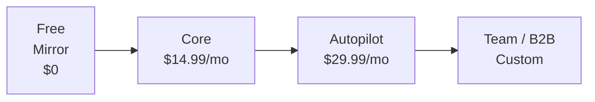

# SELF-OS — Pricing Strategy

> **📋 PRODUCT REFERENCE DOCUMENT** — This is a strategic pricing and positioning
> document, not a technical specification. It informs commercial decisions. See
> [docs/product-positioning.md](product-positioning.md) for the canonical product
> positioning document.

> Positioning SELF-OS as a premium Personal Intelligence OS, not a commodity task manager or therapy app.

---

## 1. Positioning

### What SELF-OS Is NOT

| Category | Examples | Price Range | Why We're Different |
|---|---|---|---|
| Task manager | Todoist, Things | $3–8/month | We understand *why* tasks matter, not just *what* they are |
| Note-taking app | Obsidian, Notion | $0–20/month | We auto-organize; users just capture |
| AI therapy | Woebot, Wysa | $0–15/month | We're not a clinical tool; no FDA/HIPAA required |
| AI companion | Replika | $17/month | We serve productivity and life management, not companionship |

### What SELF-OS IS

A **Personal Intelligence OS** — a new product category that combines:
- Second Brain / PKM (like Obsidian + AI)
- Autonomous Agent OS (like Motion + intelligence)
- Identity & Psyche Layer (unique to SELF-OS)

**Comparable stack:** Notion AI (~$10–20/month) + Motion (~$19–29/month) + Mem AI (~$15/month) = **$44–64/month** for three separate tools — none of which understand who you are.

SELF-OS replaces all three at a lower combined price, and adds the identity layer no competitor offers.

### Regulatory Note

SELF-OS is **not** a medical device, mental health treatment, or clinical tool:
- No FDA clearance required (not diagnosing or treating disorders)
- No HIPAA compliance required at launch (not storing PHI in clinical context)
- Category: **Productivity / Personal Development software**
- Comparable regulatory profile to: Headspace, Calm, Notion AI

This keeps compliance overhead minimal and time-to-market fast.

---

## 2. Pricing Tiers

---

### 🪞 Free — "Mirror"

**Price:** $0 (14-day full trial, then limited free tier)

**What you get during trial (days 1–14):**
- Full access to all Core features
- Goal to experience the knowledge graph, proactive agent, and identity model before committing

**What you get after trial:**
- Read-only access to your knowledge graph (your data is never deleted)
- Basic mood journaling: up to 3 entries per day
- View your top 5 nodes by importance
- Export your data at any time

**Strategic purpose:**
- Zero-friction onboarding — users experience the full product first
- Build the knowledge graph during trial → creates lock-in (the graph becomes valuable)
- Read-only after trial → users feel the loss of capability, drives conversion
- No credit card required for trial

---

### 🧠 Core — $14.99/month ($119/year — save 34%)

**Target user:** Knowledge workers who want an AI-organized second brain + identity insights, but don't need full agentic automation.

**What's included:**

| Feature | Details |
|---|---|
| Second Brain | Unlimited notes, auto-organization, atomic note splitting |
| Knowledge Graph | Full graph with AI auto-linking, semantic search |
| Identity Model | NeuroCore + PsycheState (full neurobiological model) |
| Mood Tracking | PAD model with daily/weekly trend charts |
| Pattern Reports | Weekly AI-generated insights from your graph |
| Basic Goal Tracking | Create goals, track progress manually |
| IFS Parts Awareness | Parts detection and history (no full InnerCouncil) |
| Platforms | Web + Mobile |
| LLM Tier | Standard (Qwen 3.5 Flash class) |
| Data Storage | 5 GB vector embeddings, unlimited graph nodes |

**Positioning:** Replaces Obsidian + Mem AI at lower cost, with the identity layer neither offers.

---

### 🚀 Autopilot — $29.99/month ($249/year — save 31%)

**Target user:** Founders, solopreneurs, and ambitious knowledge workers who want AI that *acts* on their behalf.

**Everything in Core, plus:**

| Feature | Details |
|---|---|
| Proactive Agent | AI creates tasks, nudges, reprioritizes based on goals + state |
| GoalEngine | Full goal hierarchy: Life → Annual → Quarterly → Sprint → Task |
| Auto-progress Tracking | % completion, velocity, predicted completion date |
| InnerCouncil | Full IFS conflict resolution for difficult decisions |
| PredictiveEngine | 7-day emotional state forecasting + proactive interventions |
| Calendar Sync | Google Calendar + Apple Calendar (read + write) |
| Todoist / Notion Sync | Bidirectional task sync |
| Priority LLM | GPT-4 class model for all responses |
| API Access | REST API for custom integrations and webhooks |
| Advanced Search | Cross-graph semantic search with faceted filters |
| Data Storage | 25 GB vector embeddings, unlimited graph nodes |
| Priority Support | 24h response SLA |

**Positioning:** Replaces Motion + Notion AI + personal coaching app — at a fraction of the combined cost, with the identity layer that makes every action aligned with who you are.

---

### 🏢 Team / B2B — Custom Pricing

**Target customer:** Companies building AI agents or managing knowledge worker teams.

#### B2B Product 1: Identity Profile API

*For AI product teams who want their agents to understand the human they serve.*

- `GET /api/v1/user/{id}/identity` — real-time PsycheState, goals, values, patterns
- `GET /api/v1/user/{id}/context` — compact LLM-injectable brief for any AI system prompt
- Rate limits: tiered by volume
- **Pricing:** $0.01–0.05 per API call (volume discounts available)
- **Use case:** Any company deploying an AI assistant (customer service bot, productivity tool, health app) can enrich their agent with SELF-OS identity context — making it dramatically more personalized

#### B2B Product 2: Corporate Wellness Dashboard

*For HR teams and employee wellbeing programs.*

- Anonymous aggregate analytics: team mood trends, burnout risk signals, goal alignment
- Individual Autopilot access for each employee
- Admin dashboard: view aggregate (not individual) insights
- **Pricing:** $8–15/employee/month (volume tiers for 50+, 200+, 500+ seats)
- Minimum: 10 seats

#### B2B Product 3: White-Label

*For coaches, therapists, and wellbeing platforms.*

- SELF-OS engine under your brand
- Custom LLM prompts and personas
- Client management dashboard
- Data isolation per client
- **Pricing:** Revenue share or fixed monthly license (custom)

---

## 3. Unit Economics

### Per-User Cost Breakdown

| Cost Category | Free | Core | Autopilot |
|---|---|---|---|
| OpenAI/LLM API | ~$0.20/month | ~$1.50/month | ~$3.50–5.00/month |
| Qdrant (vector DB) | ~$0.05/month | ~$0.30/month | ~$0.70/month |
| Infrastructure (compute, storage) | ~$0.10/month | ~$0.40/month | ~$0.80/month |
| **Total COGS** | **~$0.35/month** | **~$2.20/month** | **~$5.00/month** |
| **Revenue** | **$0** | **$14.99/month** | **$29.99/month** |
| **Gross Margin** | — | **85%** | **83%** |

### Scale Targets

| Milestone | Paying Users | MRR | ARR |
|---|---|---|---|
| Early traction | 100 | ~$2,000 | ~$24K |
| Product-market fit signal | 1,000 | ~$20,000 | ~$240K |
| Ramen profitability | 2,500 | ~$50,000 | ~$600K |
| Series A territory | 10,000 | ~$200,000 | ~$2.4M |

*Assumes 70% Core / 30% Autopilot mix. B2B revenue not included.*

### Key Levers
- **LLM cost reduction:** Switching more inference to local/smaller models (Qwen, Mistral) can cut COGS 40–60%
- **Annual plan adoption:** If 50% of users choose annual, CAC payback period drops significantly
- **B2B API:** High-margin (>90%) once infrastructure is shared; grows ARPU without proportional cost increase

---

## 4. Go-to-Market Phases

### Phase 1: Community (0 → 500 users)
- **Channel:** Telegram bot (free, no sign-up required)
- **Goal:** Validate core loop, build user stories, refine identity model
- **Monetization:** None (all free during this phase)
- **Success metric:** 10+ users with 30-day retention

### Phase 2: Product Launch (500 → 5,000 users)
- **Channel:** Product Hunt launch, Twitter/X, Hacker News, PKM communities (r/ObsidianMD, Zettelkasten forums)
- **Goal:** Paid conversion, testimonials, press
- **Monetization:** Core + Autopilot tiers go live
- **Success metric:** 500 paying users, <5% monthly churn

### Phase 3: Mobile + Scale (5,000 → 50,000 users)
- **Channel:** iOS/Android app, content marketing (personal productivity), referral program
- **Goal:** Organic growth flywheel
- **Monetization:** All tiers active, B2B Identity API beta
- **Success metric:** $200K MRR, NPS > 50

### Phase 4: Platform (50,000+ users)
- **Channel:** B2B sales (AI teams, enterprise HR), marketplace for agent integrations
- **Goal:** Platform network effects — the more agents use the Identity API, the more valuable SELF-OS becomes
- **Monetization:** B2B contracts, API usage fees, white-label licensing
- **Success metric:** $1M MRR, 10+ enterprise customers

---

## 5. Pricing Psychology & Strategy Notes

**Why $14.99 and not $15.00?**
Psychological price point. $14.99 sits in the "under $15" mental bucket — critical for consumer SaaS conversion.

**Why offer annual discounts?**
Improves cash flow, reduces churn risk, and signals commitment from the user. 30%+ discount on annual is standard for B2C SaaS.

**Why keep the free tier?**
The knowledge graph becomes more valuable the longer it's used. Even free users are building an asset they don't want to lose — which drives eventual conversion.

**Why not freemium-first?**
Trial-then-limited is better than unlimited freemium for a product with real LLM costs. Users get the full experience first, then choose to pay rather than being limited from day one.

---

## Cross-References

- **Product features per tier:** See [VISION.md](VISION.md) — Three Pillars section
- **B2B Identity API:** See [ROADMAP.md](ROADMAP.md) — Stage 4.5
- **Competitive pricing context:** See [COMPETITIVE.md](COMPETITIVE.md) — Competitive Matrix
