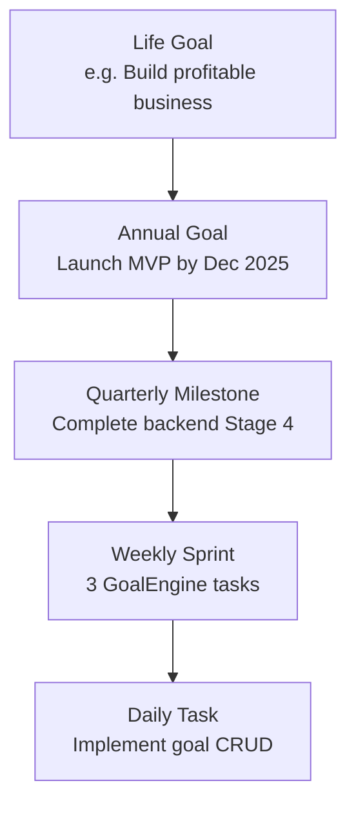
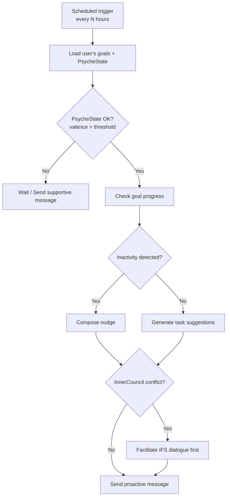

> **⚠️ LEGACY DOCUMENT — retained for historical reference only.**
> The canonical roadmap is **[docs/roadmap.md](roadmap.md)**. New contributors should read that document instead.
> The Stage 1–5 model here provides useful implementation history. The phase-based roadmap in [docs/roadmap.md](roadmap.md) supersedes this document for current direction.

---

# SELF-OS — Technical Roadmap

> Living document tracking what's built, what's in progress, and what's planned.

---

## Overview

```mermaid
gantt
    title SELF-OS Development Stages
    dateFormat  YYYY-Q[Q]
    axisFormat  %Y Q%q
    section Stage 1
    Passive Knowledge Graph   :done, s1, 2024-Q1, 2024-Q2
    section Stage 2
    Consolidating Memory      :done, s2, 2024-Q2, 2024-Q4
    section Stage 3
    Society of Mind           :done, s3, 2024-Q4, 2025-Q2
    section Stage 4
    Personal Intelligence OS  :active, s4, 2025-Q2, 2026-Q2
    section Stage 5
    Therapeutic Self          :s5, 2026-Q2, 2027-Q1
```

| Stage | Name | Status |
|---|---|---|
| 1 | Passive Knowledge Graph | ✅ Complete |
| 2 | Consolidating Memory | ✅ Complete |
| 3 | Society of Mind (Agentic Functions) | ✅ Complete |
| 4 | Personal Intelligence OS | 🔜 Next |
| 5 | Therapeutic Self & Theory of Mind | 🔮 Future |

---

## Stage 1: Passive Knowledge Graph ✅ DONE

*Foundation: a typed semantic graph that stores the user's inner world.*

### What Was Built

**Storage Layer (`core/graph/`)**
- SQLite-based graph storage with async reads/writes (`storage.py`)
- Event-sourced wrapper — immutable audit log of all mutations (`event_store.py`)
- High-level CRUD interface (`api.py`)
- Node and Edge dataclasses (`model.py`)
- Optional Neo4j backend (`neo4j_storage.py`)

**Node Types:**
`NOTE` · `EMOTION` · `BELIEF` · `NEED` · `VALUE` · `TASK` · `PROJECT` · `EVENT` · `PERSON` · `PART` · `SOMA` · `INSIGHT` · `THOUGHT` · `GOAL`

**Edge Relations:**
`RELATES_TO` · `TRIGGERS` · `CONFLICTS_WITH` · `SUPPORTS` · `PART_OF` · `FOLLOWED_BY` · `GOAL_HAS_MILESTONE` · `MILESTONE_HAS_TASK` · `CONTRIBUTES_TO`

**Journal Storage**
- Raw message archival before any processing
- Immutable record of everything the user has ever told SELF-OS

### Key Design Decisions
- SQLite primary (zero-ops, embedded) with Neo4j as optional upgrade path
- Event sourcing from day one: every mutation is logged, enabling replay and audit
- Unique constraint on `(user_id, source_node_id, target_node_id, relation)` for edge deduplication

---

## Stage 2: Consolidating Memory ✅ DONE

*Making the graph intelligent: extracting meaning, embedding knowledge, surfacing patterns.*

### What Was Built

**OODA Pipeline (`core/pipeline/`)**
- `MessageProcessor` — main orchestrator
- `ObserveStage` — sanitize input, write to journal, classify input type
- `OrientStage` — LLM entity extraction, embedding generation, RAG search
- `DecideStage` — policy selection, mood update, parts tracking
- `ActStage` — response generation, session update, event emission

**LLM Integration (`core/llm/`)**
- OpenAI / OpenRouter abstraction
- Structured extraction prompts for entity recognition
- Embedding generation via `text-embedding-3-small` (1536-dim)

**Vector Search (`core/search/`)**
- `QdrantVectorStorage` — semantic similarity search
- Hybrid retrieval: vector + graph-aware reranking

**Memory & Context (`core/context/`, `core/memory/`)**
- `GraphContextBuilder` — assembles rich context from graph nodes for LLM prompts
- `SessionMemory` — in-memory short-term conversation buffer
- `PersistentSessionMemory` — SQLite-backed session continuity
- Memory lifecycle: consolidation → abstraction → forgetting with spaced repetition
- Belief reconsolidation: automatic detection and resolution of contradictions

**Analytics (`core/analytics/`)**
- `MoodTracker` — PAD model (valence, arousal, dominance) snapshots
- `PartsMemory` — IFS sub-personality detection and history (`core/parts/`)
- `PatternAnalyzer` — recurring pattern detection across graph
- `InsightEngine` — cross-pattern insight generation (`core/insights/`)
- `CausalDiscovery` — causal relationship inference between nodes
- `GNNPredictor` — graph neural network link prediction
- `ContrastiveLearner` — contrastive embedding learning
- `IdentitySnapshot` / `SnapshotDiff` — periodic identity state diffing
- `CognitiveDistortionDetector` — CBT-based automatic distortion identification
- L2 `AnalysisEngine` — strict schema validation, hybrid fusion (semantic + statistical)

**Infrastructure**
- `EventBus` — pub/sub for pipeline events
- `ToolRegistry` — extensible tool system (`SearchMemoryTool`, `GetProjectsTool`, `GetInsightsTool`, `GetMoodTrendTool`)
- `MemoryScheduler` (APScheduler) — background consolidation jobs
- Weekly report generation

---

## Stage 3: Society of Mind ✅ DONE

*Agentic functions: multiple AI agents with distinct personalities, a neurobiological model, and state forecasting.*

### What Was Built

**InnerCouncil — IFS Multi-Agent Debate (`agents/ifs/`)**
- `InnerCouncil` — orchestrates 2-round IFS debate (`council.py`)
- `CriticAgent` — represents the inner critic / evaluator
- `FirefighterAgent` — represents protective/reactive impulses
- `ExileAgent` — represents vulnerable/wounded parts
- `SelfAgent` — neutral mediator that synthesizes resolution
- Somatic check takes priority: if body signals are detected, somatic path activates before multi-part debate
- `AgentOrchestrator` — dynamic routing of agent chains based on intent + PsycheState context

**NeuroCore — Neurobiological Engine (`core/neuro/`)**
- `NeuroCore` — main engine with neurons, synapses, spreading activation (`engine.py`)
- `Neuron` / `Synapse` / `BrainState` dataclasses (`schema.py`)
- Hebbian learning: connection strength updates based on co-activation
- Spreading activation: energy propagates through the graph from activated nodes
- Decay cycles: unused connections fade to maintain currency
- Neurotransmitter modifiers: dopamine, cortisol, serotonin analog parameters
- `NeuroBridge` — translates pipeline `Node`/`Edge` structures → `NeuroCore` neurons/synapses (`core/neuro/bridge.py`)
- `BrainState` snapshots injected into `graph_context["brain_state"]` for LLM prompts

**PredictiveEngine — State Forecasting (`core/prediction/`)**
- `PredictiveEngine` — EWMA-based emotional state forecasting (`engine.py`)
- `PsycheState` + `PsycheStateForecast` + `InterventionImpact` DTOs (`state_model.py`)
- Learns from `OutcomeTracker` data: past interventions that worked are weighted higher
- Intervention simulation: models likely impact of different response strategies before sending

**PsycheState — Unified Identity Snapshot (`core/psyche/`)**
- Combines PAD emotional state + active IFS parts + cognitive load + active goals
- Updated after every OODA cycle
- `PsycheStateBuilder` constructs snapshot from current graph state
- `PsycheStateStore` provides persistence and historical lookup

**Therapy Layer (`core/therapy/`)**
- `TherapyPlanner` — selects appropriate modality (CBT / ACT / IFS / somatic / validation) from PsycheState
- `InterventionSelector` — wraps planner with cooldown logic and RLHF effectiveness filtering

---

## Stage 4: Personal Intelligence OS 🔜 NEXT

*The full product vision: goal tracking, proactive agents, second brain workspace, integrations, and the Identity API.*

### 4.1 GoalEngine

**Purpose:** Transform SELF-OS from reactive assistant to proactive life co-pilot.

**Planned implementation (`core/goals/`):**
- Goal CRUD: create, read, update, archive goals with metadata (title, description, target date, parent goal)
- Goal hierarchy: `LIFE GOAL → ANNUAL GOAL → QUARTERLY MILESTONE → WEEKLY SPRINT → DAILY TASK`
- Auto-linking: new tasks/notes auto-attach to relevant goals via embedding cosine similarity
- Progress tracking: % completion, velocity (tasks/week), predicted completion date based on current rate
- New node types: `GOAL`, `MILESTONE`
- New edge relations: `GOAL_HAS_MILESTONE`, `MILESTONE_HAS_TASK`, `CONTRIBUTES_TO`



**API endpoints:**
- `POST /goals` — create goal
- `GET /goals/{id}` — get goal with progress
- `PUT /goals/{id}` — update goal
- `DELETE /goals/{id}` — archive goal
- `GET /goals/{id}/milestones` — get milestone tree

---

### 4.2 Proactive Agent

**Purpose:** AI that initiates — doesn't wait to be asked.

**Planned implementation (`core/agents/proactive.py`):**
- `ProactiveAgent` class with scheduled analysis loop (cron-like, every N hours)
- Goal + state review: compare current progress against targets, check PsycheState
- Auto-generate task suggestions: "Based on Goal X and current progress, I suggest 3 tasks for today"
- Nudge system:
  - Inactivity nudge: "You haven't touched Project Y in 5 days. Deadline in 2 weeks."
  - Energy-aligned nudge: "Your energy is high right now — ideal for deep work on Goal Z"
  - Conflict blocker: if InnerCouncil detects unresolved conflict about a goal, address it first
- State-gating: PsycheState check before every nudge — no pushes during high-stress / low-energy windows

**Logic flow:**


---

### 4.3 Second Brain / PKM Workspace

**Purpose:** Zero-friction knowledge capture with AI-powered organization.

**Planned implementation:**
- `core/inbox/processor.py` — `InboxProcessor` class
  - Accepts any unstructured input: text, voice transcript, photo description, URL
  - LLM parses → creates typed nodes (`NOTE`, `TASK`, `IDEA`, `PERSON`, `PROJECT`, etc.)
  - New nodes auto-linked to existing graph via embedding similarity search
- `core/pkm/organizer.py` — `PKMOrganizer` class
  - Atomic note splitting: long texts → multiple atomic Zettelkasten-style notes
  - Daily Review: auto-generated summary of new knowledge added that day
  - Weekly Review: new connections discovered, emerging themes, insight highlights
  - Semantic search: `GET /search?q=<query>` returns ranked nodes by semantic similarity

**Inbox API:**
- `POST /inbox` — dump anything; returns list of created/linked nodes
- `GET /inbox/review/daily` — today's knowledge summary
- `GET /inbox/review/weekly` — weekly synthesis

---

### 4.4 Integration Layer

**Purpose:** SELF-OS as the hub; existing tools as spokes.

**Planned implementation (`integrations/`):**

| Integration | Direction | Description |
|---|---|---|
| Google Calendar | Read + Write | Read availability; write scheduled tasks/focus blocks |
| Apple Calendar | Read | Read calendar events into graph |
| Todoist | Read + Write | Export tasks; import completions |
| Notion | Write | Export notes/tasks to Notion pages |
| Telegram Bot | Bidirectional | Primary conversational interface (aiogram) |
| REST API | Bidirectional | Web / mobile frontend integration |
| Webhook system | Inbound | External events → SELF-OS inbox |

**File structure:**
```
integrations/
├── calendar/
│   ├── google.py       # Google Calendar sync
│   └── apple.py        # Apple Calendar read
├── tasks/
│   ├── todoist.py      # Todoist sync
│   └── notion.py       # Notion export
├── messaging/
│   └── telegram.py     # Telegram bot (moved from interfaces/)
├── api/
│   ├── router.py       # FastAPI router
│   └── webhooks.py     # Webhook ingestion
└── base.py             # BaseIntegration ABC
```

---

### 4.5 Identity Profile API

**Purpose:** Allow any external AI agent to instantly understand the user by querying SELF-OS.

**Planned endpoints:**

```
GET /api/v1/user/{id}/identity
```
Returns: current `PsycheState` + top active goals + core values + dominant cognitive patterns + recent emotional trend

```
GET /api/v1/user/{id}/context
```
Returns: a compact contextual brief optimized for injection into external LLM system prompts — allows any AI agent (GPT, Claude, Gemini) to act with full awareness of who they're serving

**Example response (`/identity`):**
```json
{
  "user_id": "u_123",
  "timestamp": "2025-09-01T09:00:00Z",
  "psyche_state": {
    "valence": 0.3,
    "arousal": 0.6,
    "dominance": 0.5,
    "active_parts": ["Critic", "Protector"],
    "cognitive_load": "medium"
  },
  "top_goals": [
    {"id": "g_1", "title": "Launch SELF-OS MVP", "progress": 0.42},
    {"id": "g_2", "title": "Improve physical fitness", "progress": 0.28}
  ],
  "core_values": ["autonomy", "creativity", "impact"],
  "patterns": ["anxiety→avoidance", "low_energy→procrastination"],
  "emotional_forecast": {"7d_valence_trend": "rising", "confidence": 0.74}
}
```

**B2B use case:** Companies building AI agents pay for API access to enrich their agent's system prompt with real-time user identity context. See [PRICING.md](PRICING.md) for B2B tier details.

---

## Stage 5: Therapeutic Self & Theory of Mind 🔮 FUTURE

*The endgame: a true AI companion that understands you as deeply as a skilled therapist — and can coordinate all dimensions of your life.*

### Planned Features

**EpistemicStateModel**
- Tracks the user's epistemic state: trust in AI recommendations, resistance to change, self-efficacy
- Adapts communication style based on current epistemic stance
- Detects when the user is in a "growth mindset" vs. "defensive mode"

**TherapeuticSelf — Meta-Agent**
- Coordinates all modalities: CBT, IFS, ACT, somatic, validation, psychoeducation
- Selects and sequences interventions based on full psychological context
- Tracks therapeutic progress over months, not just sessions
- Adjusts approach as the user's needs evolve

**Theory of Mind**
- Models the user's key relationships: partner, friends, colleagues, family
- Tracks social dynamics: tension patterns, communication styles, unmet needs in relationships
- Offers relationship coaching grounded in the user's identity model

**Life Coordination**
- Financial goals, health goals, and relationship goals unified in one graph
- Cross-domain insight: "Your financial stress correlates with relationship tension (r=0.72 over 6 months)"

**SSM Upgrade: Mamba Model**
- Replace EWMA forecasting with a trained State Space Model (Mamba architecture)
- Trained on user's own mood/activity history
- Much richer forecasting: can model cyclical patterns (weekly rhythm, seasonal mood), sudden state shifts

**Multi-User Shared Goals**
- Partners or teams can share a goal space
- SELF-OS models each person's identity separately, then finds alignment and conflict
- Negotiation support: "You and your partner both have 'family time' as a top value but it activates different fears"

---

## Implementation Notes

### Current Test Coverage
- 416 tests across all modules (`python -m pytest tests/`)
- Every new Stage 4 component should include unit tests following existing `asyncio.run()` pattern

### Linting
- `ruff check .` — zero violations required

### Database Migrations
- New node types / edge relations added via migration scripts in `scripts/`
- Schema changes are backward-compatible (new columns are nullable or have defaults)

---

## Cross-References

- **Product vision and user stories:** See [VISION.md](VISION.md)
- **Competitive landscape:** See [COMPETITIVE.md](COMPETITIVE.md)
- **Pricing and go-to-market:** See [PRICING.md](PRICING.md)
- **System architecture:** See [ARCHITECTURE.md](ARCHITECTURE.md)
