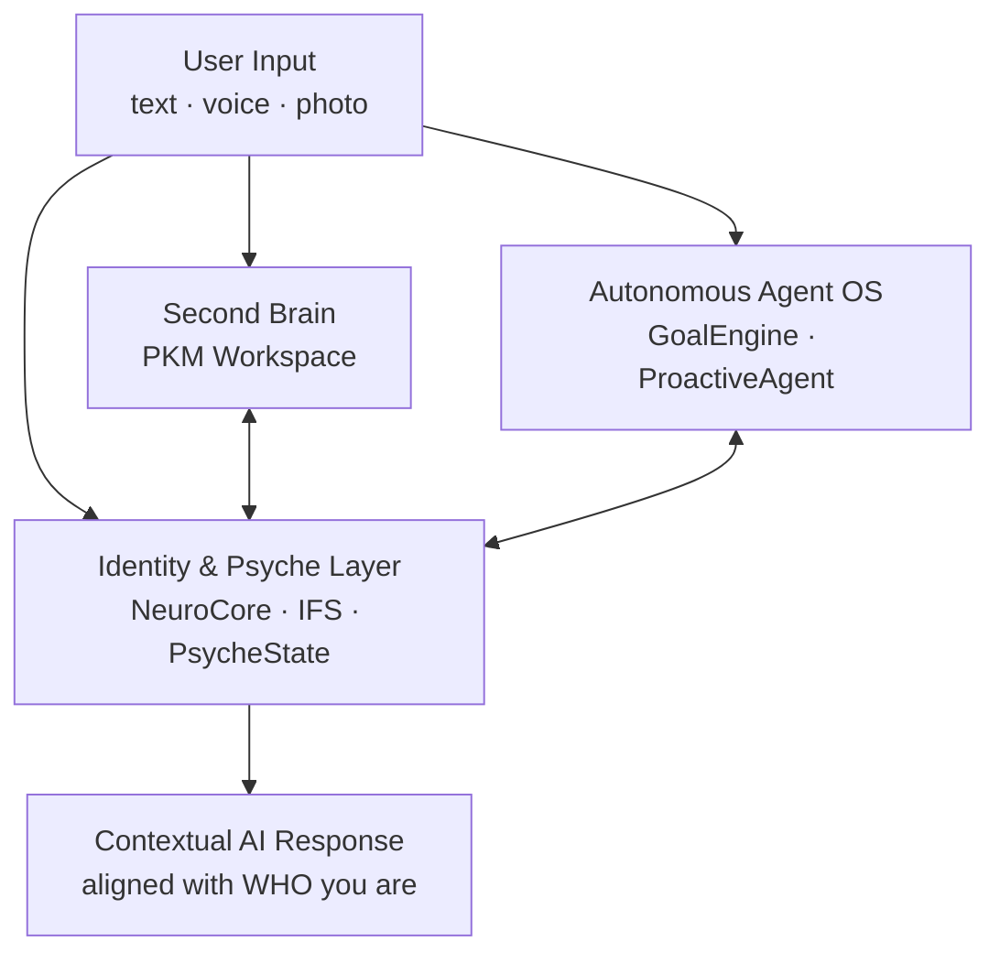
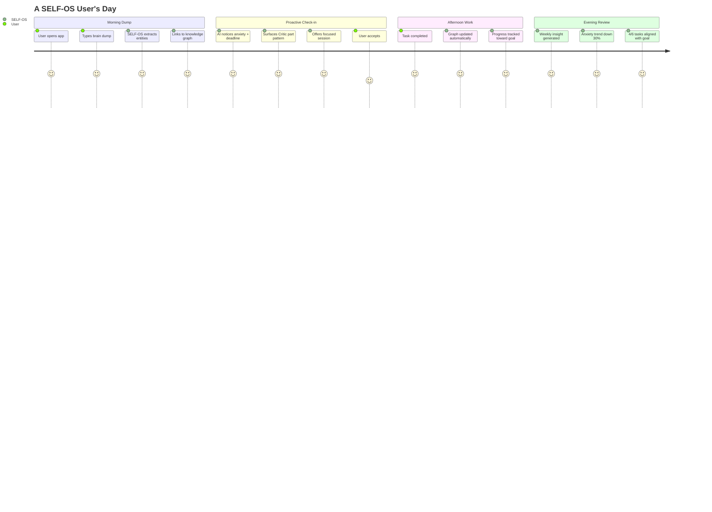

> **⚠️ LEGACY DOCUMENT — retained for historical reference only.**
> The canonical vision document is **[docs/vision.md](vision.md)**. New contributors should read that document instead.
> Content here represents an earlier product-vision draft and is preserved for context.

---

# SELF-OS — Product Vision

> *"Your AI that actually knows you — so it can act as you."*

---

## 1. Executive Summary

### The Problem

AI agents are proliferating fast. Every major platform now offers an "AI assistant" that can write emails, schedule meetings, and summarize documents. But they all share the same critical blind spot: **they don't know who they're serving.**

Today's AI agents execute instructions without understanding the human behind them. They have no model of your values, your beliefs, your emotional state, or your real priorities. Ask two very different people the same question and they'll receive the same generic answer. That's not intelligence — that's automation.

The result: tasks get done, but decisions are misaligned. Recommendations feel hollow. Agents push work when you're exhausted and stay silent when you need a nudge. They optimize for the stated goal while ignoring the person behind it.

### The Solution

**SELF-OS** is a **Personal Intelligence Operating System** — a new product category that gives AI agents the one thing they're missing: a deep, living model of the human they serve.

SELF-OS combines three paradigms into a single, unified platform:

1. **Second Brain / PKM Workspace** — capture raw thoughts; AI auto-organizes them into a knowledge graph
2. **Autonomous Agent OS** — AI proactively creates tasks, reprioritizes, nudges, and acts on your behalf
3. **Identity & Psyche Layer** — a living model of who you ARE: values, beliefs, emotional state, inner conflicts, cognitive patterns

The third pillar is the breakthrough. It transforms AI from a tool that executes tasks into a **co-pilot that understands you** — and acts accordingly.

### One-Liner

**"Your AI that actually knows you."**

---

## 2. The Three Pillars

### Pillar 1: Second Brain (PKM Workspace)

Most knowledge management tools require users to organize. SELF-OS flips this: **you dump, AI organizes.**

**How it works:**
- User sends anything — a fleeting thought, a voice memo transcript, a photo description, a to-do
- SELF-OS automatically extracts entities: projects, tasks, people, beliefs, goals, emotions
- Each entity becomes a typed **node** in a semantic knowledge graph
- Nodes are auto-linked via embedding similarity, causal relationships, and semantic proximity
- Emergent structure: the graph reveals connections the user never explicitly made

**Key design principles:**
- **Zettelkasten-inspired**: atomic notes, bidirectional links, emergent structure
- **Zero friction capture**: the inbox accepts anything; organization happens asynchronously
- **Graph over folders**: relationships matter more than hierarchy

**Unlike Obsidian/Roam:** the AI does the organizing. The user just dumps. No tagging, no linking, no maintenance.

**Technologies:** Knowledge Graph (SQLite-backed, Neo4j-compatible), Qdrant vector storage, EmbeddingService, OODA extraction pipeline.

---

### Pillar 2: Autonomous Agent OS

SELF-OS doesn't wait to be asked. It watches your goals, tracks your progress, and **proactively acts on your behalf.**

**GoalEngine:**
- User sets high-level life goals ("build a profitable business", "improve physical health")
- AI breaks them into milestones → quarterly objectives → weekly sprints → daily tasks
- New notes and tasks are automatically linked to relevant goals via semantic similarity
- Progress is tracked continuously: % completion, velocity, predicted completion date

**Proactive Agent:**
- Scheduled analysis (every N hours): review goals, state, recent activity
- Auto-generates task suggestions: "Based on Goal X and your current energy, here are 3 tasks for today"
- Nudges when momentum drops: "You haven't touched Project Y in 5 days. Your deadline is in 2 weeks."
- State-aware: does **not** push work when PsycheState signals high stress or low energy
- Conflict-aware: if InnerCouncil detects an internal conflict about a goal, it addresses the conflict *before* pushing tasks

**Smart Prioritization:**
- Not just by deadline — by alignment with current emotional state, energy level, and core values
- A task due next week that aligns with your top value gets higher priority than an urgent but low-meaning errand

**Technologies:** GoalEngine, ProactiveAgent, OODA Pipeline, PredictiveEngine, ToolRegistry, Calendar/Todoist integration (Stage 4).

---

### Pillar 3: Identity & Psyche Layer (The Moat)

This is what no competitor has. It's the "soul" of the system — the layer that transforms SELF-OS from a smart tool into a **genuine co-pilot.**

**NeuroCore:**
- A neurobiological model of the user's mind: neurons (beliefs, emotions, needs, values, parts) with activation levels
- Hebbian learning: "neurons that fire together, wire together" — connections strengthen through usage
- Spreading activation: activating one node (e.g., "anxiety") spreads energy to connected nodes ("avoidance", "Critic part")
- Synaptic decay: unused connections fade over time, keeping the model current
- Neurotransmitter modifiers: dopamine, cortisol, serotonin analog parameters that modulate activation

**IFS InnerCouncil:**
- Internal Family Systems model: the user's psyche has distinct "parts" (Critic, Protector, Exile, Self)
- When a user faces conflicting desires, the AI facilitates a structured internal dialogue between parts
- 2-round debate: each part argues its position → Self mediates → synthesized resolution emerges
- Prevents the AI from bulldozing internal conflicts with toxic positivity

**PsycheState:**
- A unified real-time snapshot of who the user IS right now
- Components: PAD emotional state (valence, arousal, dominance) + active IFS parts + cognitive load + active goals
- Updated after every interaction — a living document of the user's inner landscape

**PredictiveEngine:**
- EWMA-based forecasting of emotional state: predicts where the user's mood is heading
- Enables proactive interventions *before* the user hits a crisis point
- Learns from outcome data: if an intervention worked before, it's weighted higher

**BrainState:**
- Neurobiological snapshot: current activation levels, dominant neurotransmitter profile, spreading activation map
- Used by the Proactive Agent to determine *when* to nudge and *how* to frame messages

**This layer is what no competitor has.** It's the reason SELF-OS can say: "I notice you tend to avoid this project when your Critic part is active. Your valence is low. Let's do a 25-minute focused session now while your dopamine is still elevated."

---

## 3. How It Works — A Day in the Life

**Morning — Brain Dump:**
> User opens SELF-OS and types: *"feeling anxious about the presentation tomorrow, also need to call mom, had an idea for the startup about onboarding"*

**SELF-OS processes this automatically:**
- Extracts `EMOTION: anxiety` → links to `PROJECT: presentation` (existing node)
- Extracts `TASK: call mom` → creates with soft deadline (today/tomorrow)
- Extracts `THOUGHT: startup onboarding idea` → files under `PROJECT: SELF-OS`, creates atomic note

**Identity layer activates:**
- PredictiveEngine detects: anxiety spike + presentation deadline in 18 hours + historical pattern of procrastination on this project
- NeuroCore: Critic part activation rising, valence dropping, avoidance behavior predicted
- ProactiveAgent composes response:

> *"I notice you're feeling anxious about tomorrow's presentation. Your Critic part tends to get loud around deadlines, which can lead to avoidance. Your energy is still decent right now. Want to do a focused 25-minute session on the slides? I'll block your calendar."*

**Evening — Weekly Insight:**
> *"Your anxiety around Project X decreased 30% this week compared to last. You completed 4 of 6 tasks aligned with your Career Development goal. Your Critic part activated 3 times — each time followed by avoidance. Suggested experiment for next week: notice Critic activation and respond with a 5-minute grounding exercise instead of switching tasks."*

This is not generic AI advice. This is personalized intelligence built from **your** graph, **your** patterns, **your** history.

---

## 4. Why Now

**AI agents are commoditizing.** GPT wrappers are cheap to build. Every product will have an "AI assistant" by 2026. The question is no longer *whether* AI can execute tasks — it's *whether AI understands who it's executing for.*

**The identity gap is the next frontier:**
- Current agents: "Here's a schedule for your week" (optimized for efficiency)
- SELF-OS agents: "Here's a schedule that respects your energy cycles, protects your focus time, and prioritizes the goal you said matters most — not the one that's loudest in your inbox"

**Three converging trends make this the right moment:**
1. **LLM costs dropping** — running a sophisticated extraction + generation pipeline is now economically viable at consumer scale
2. **Behavioral data richness** — users increasingly live digitally; their digital traces can build accurate identity models
3. **Agent proliferation** — as more AI agents enter workflows, the value of a shared "identity context" layer grows exponentially (network effect)

**The winner is whoever builds the best understanding of the human.** SELF-OS is that layer.

---

## 5. Target Users

| Priority | Segment | Profile | Pain Point | SELF-OS Value |
|---|---|---|---|---|
| **1** | Knowledge workers | 25-45, US, desk job | Tool overload; nothing "gets" them | One place that knows you + auto-organizes |
| **2** | Founders / solopreneurs | Building something | AI co-pilot that knows their *vision*, not just calendar | GoalEngine + identity context for decisions |
| **3** | Self-development enthusiasts | Journalers, Obsidian users, habit trackers | Manual maintenance; no synthesis | Auto-organized graph + identity insights |
| **4** | Coaching / therapy clients | In personal development | Insights between sessions; no continuity | Practice partner with memory + IFS model |
| **5** | B2B: AI agent builders | Companies deploying agents | Agents give generic answers | Identity API: instant user context for any agent |

---

## 6. Cross-References

- **Technical architecture:** See [ROADMAP.md](ROADMAP.md) — Stages 1–5 and implementation details
- **Market positioning:** See [COMPETITIVE.md](COMPETITIVE.md) — competitive matrix and differentiation
- **Pricing model:** See [PRICING.md](PRICING.md) — tier strategy and unit economics
- **System architecture:** See [ARCHITECTURE.md](ARCHITECTURE.md) — module-level technical documentation
